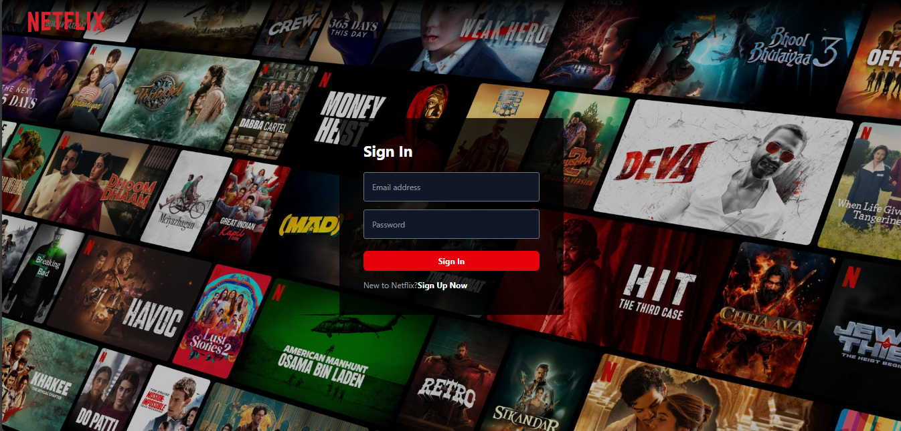
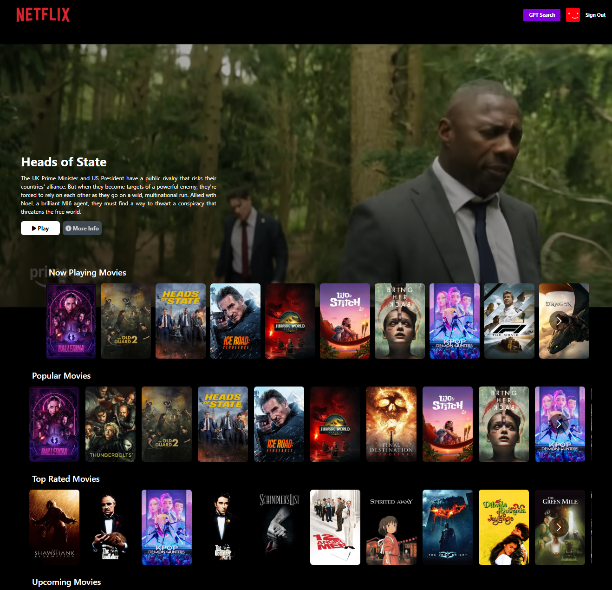

# 🎬 Netflix GPT – AI-Powered Movie Recommendation App

Netflix GPT is a React-based movie recommendation app that combines the power of **TMDB API** and **OpenAI GPT API** to provide users with smart, AI-generated movie suggestions. It also includes a Netflix-style UI, trailers, authentication, and multi-language support.

## 🔗 Live Demo
[🌐 View Netflix GPT](https://netflixgpt-a6707.web.app/)

## 📁 GitHub Repository
[📂 GitHub Source Code](https://github.com/codewithaakash22/NetflixGpt)

---

## 🚀 Features

- 🔐 **Firebase Authentication** (Sign Up / Sign In / Sign Out)
- 📺 **Browse Page** with trailers, movie rows, and categories
- 🤖 **GPT-powered Movie Suggestions** based on user prompts
- 🎞️ Fetches data using **TMDB API** (Now Playing, Popular Movies, etc.)
- 📱 Fully responsive and Netflix-like UI using **Tailwind CSS**
- ⚛️ State management using **Redux Toolkit**
- 🎬 Embedded YouTube trailers with autoplay and mute
- 🔄 Protected routing for authenticated users

---

## 🛠️ Tech Stack

### Frontend
- **React.js** (with Vite)
- **Tailwind CSS**
- **Redux Toolkit**

### APIs
- **TMDB API** – Movie data
- **OpenAI GPT API** – Smart search suggestions

### Backend/Services
- **Firebase** – Authentication & hosting

---

## 📸 Screenshots

> 
> 

---

## ⚙️ Installation & Setup

```bash
# 1. Clone the repository
git clone https://github.com/codewithaakash22/NetflixGpt.git

# 2. Navigate to the project folder
cd NetflixGpt

# 3. Install dependencies
npm install

# 4. Create a .env file and add your keys
VITE_FIREBASE_API_KEY=your_key
VITE_TMDB_API_KEY=your_tmdb_key
VITE_OPENAI_API_KEY=your_openai_key

# 5. Run the app
npm run dev
